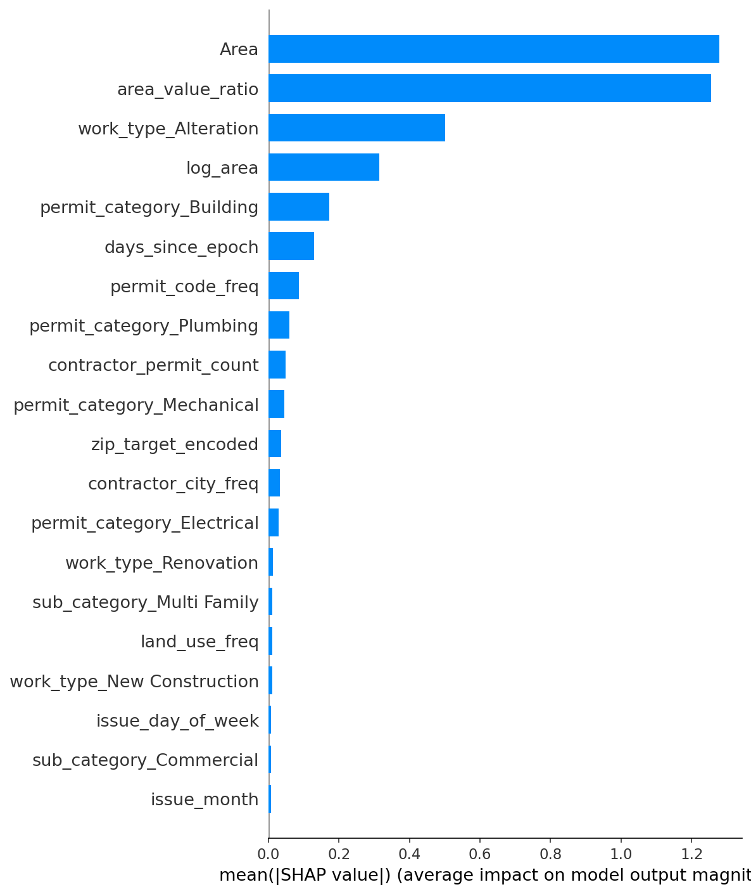
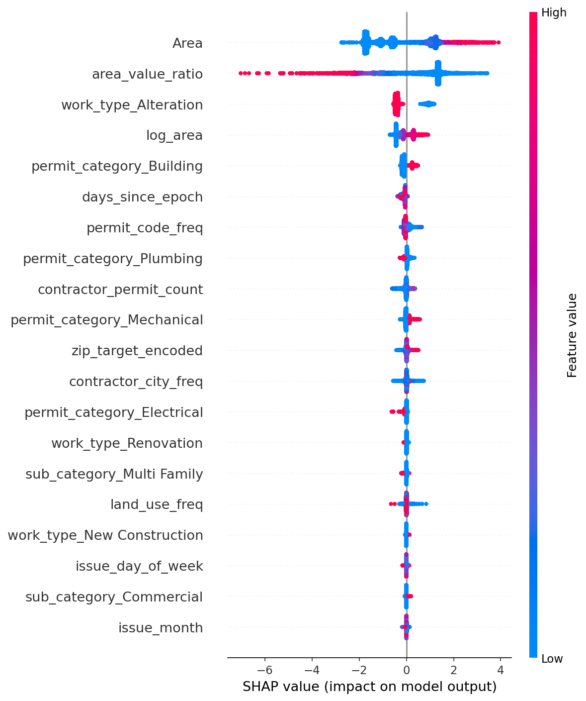
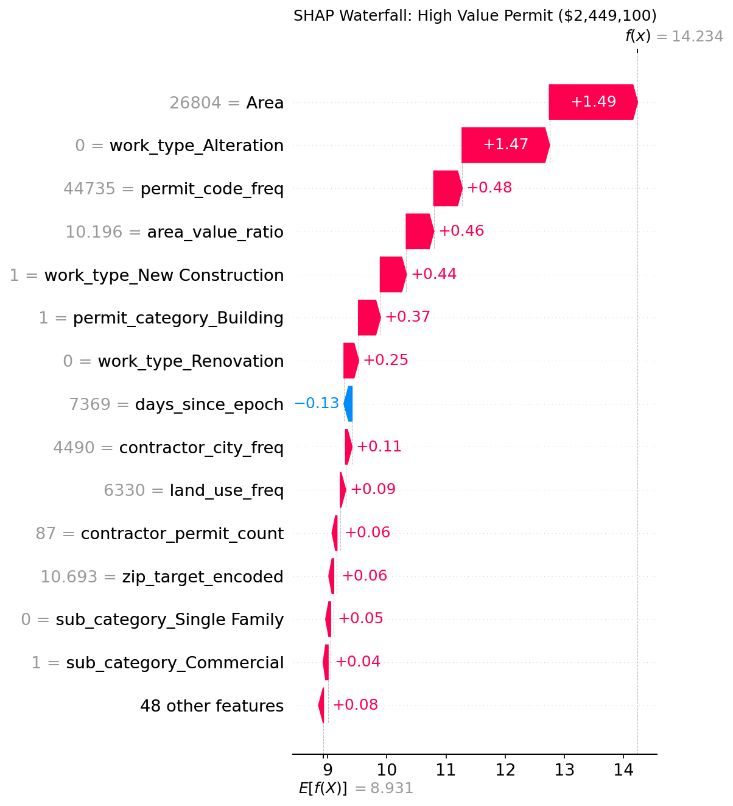
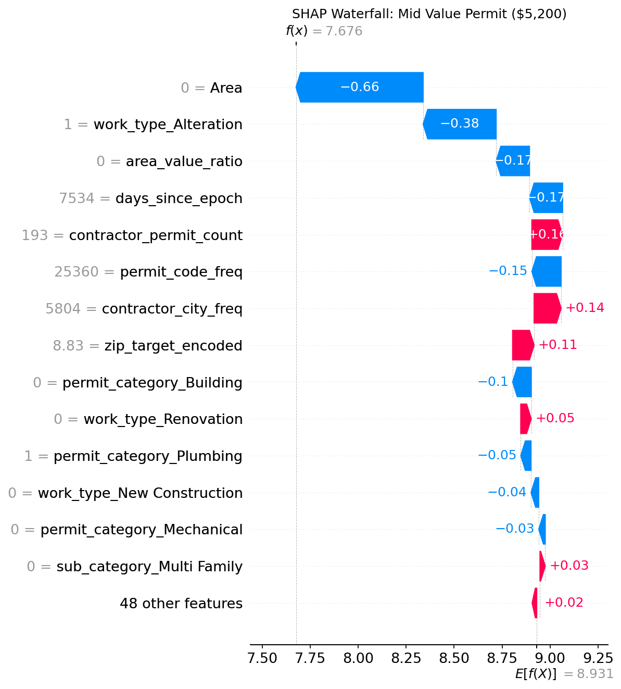
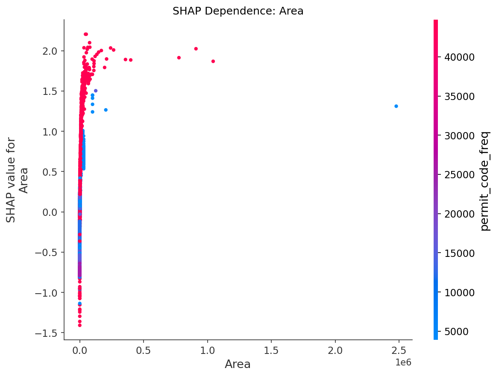
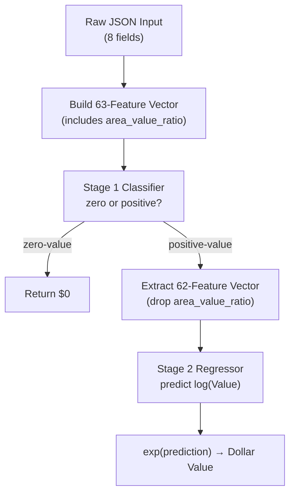
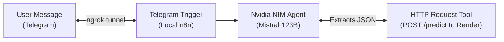

# Dallas Permit Value Predictor: Comprehensive Project Report

**From Model Interpretability to AI Agent Deployment**

This report details the final phases of the ASDS-6302 Dallas Building Permits project. It covers the interpretability of the machine learning model (SHAP), the deployment of the model via a REST API, and the integration of an AI Agent to interact with the model via Telegram. It serves as both an executive summary for stakeholders and a recreation guide for developers.

---

## Part 1: Model Interpretability (SHAP Analysis)

The core engine of this project is a **Two-Stage Hurdle Model** using XGBoost. Because 23.7% of building permits have a declared value of $0 (administrative permits like barricades or signs), a standard regression model fails. We split the problem into two stages:
1. **Classifier (Stage 1):** Is the permit value $0 or positive? (Uses 63 features)
2. **Regressor (Stage 2):** If positive, what is the log(Value)? (Uses 62 features)

To build trust with stakeholders, we use **SHAP (SHapley Additive exPlanations)** to unpack the "black box" of the Stage 2 Regressor and explain exactly *why* the model makes specific predictions.

### 1.1 Global Feature Importance
What matters most when estimating a permit's value?



The top three drivers of construction cost are:
1. **work_type_Alteration:** Is this an alteration or new construction?
2. **Area:** The total square footage.
3. **permit_code_freq:** The type of permit (e.g., standard Building permit vs. Mechanical).

*Note: In Pipeline v2, `area_value_ratio` was removed from the regressor to prevent data leakage, ensuring the model's performance metrics reflect true real-world capabilities.*

### 1.2 Feature Impacts (Beeswarm Plot)
How do specific feature values push the prediction?



- **Red dots = High value for that feature, Blue dots = Low value.**
- **Area:** Red dots shoot far to the right. Larger buildings monotonically increase the predicted cost.
- **Alteration:** Red dots cluster to the left. If a project is an alteration (vs. new construction), the model significantly reduces the predicted cost.

### 1.3 Local Explanations (Waterfall Plots)
SHAP allows us to explain *individual* predictions exactly as a human permit officer would.

#### Example A: High-Value Commercial Project ($2.4M)

Starting from an average baseline of ~$7,600 (E[f(X)] = 8.931 in log-space), the model adds value because:
- The area is massive (26,804 sqft)
- It is *not* an alteration (it is New Construction)
- It is a structural Building permit.

#### Example B: Mid-Value Repair Project ($5,200)

Contrast this with a $5,200 prediction. The model subtracts value from the baseline because:
- The area is 0 sqft.
- It *is* an alteration.

### 1.4 Non-Linear Relationships (Dependence Plot)

The model learns that adding square footage matters a lot for small buildings, but there are diminishing returns for mega-buildings (the curve flattens out past 50,000 sqft).

---

## Part 2: API Deployment Strategy

To make the model usable, we deployed it as a REST API using **Flask**, served via **gunicorn**, and hosted on **Render's cloud platform**.

### 2.1 The Dual-Feature-Set Pipeline
A critical engineering challenge was bridging human inputs (8 simple fields) to the 63 features required by the model.



**Bug Fix Highlight:** During testing, if a user typed "Commercial Office Building" instead of "Office Building", the API failed. We implemented a **3-tier fuzzy string matcher** in `app.py` to gracefully handle messy human inputs.

### 2.2 Endpoints
- `GET /` : Interactive HTML form for manual testing.
- `GET /health` : API status monitor.
- `POST /predict` : The core inference engine.

---

## Part 3: AI Agent Integration (n8n & Telegram)

The final phase brings the API to the user via a conversational AI Agent on Telegram, built using **n8n**.

### 3.1 Architecture



### 3.2 The Webhook Bridge (ngrok)
Telegram requires a public HTTPS URL to send messages to. Because our n8n instance runs locally (`localhost:5678`), we used **ngrok** to create a secure tunnel bridging the internet to the local machine.

### 3.3 The Nvidia NIM Agent
Instead of a simple scripted bot, we deployed a **Tools Agent** powered by Nvidia NIM (`mistralai/devstral-2-123b-instruct-2512`). 

The Agent's system prompt instructs it to:
1. Parse natural language (e.g., *"How much for a 2000 sqft house in 75201?"*).
2. Extract the 5 required parameters (area, zip, permit type, work type, occupancy).
3. **Use a Tool** to send an HTTP POST request to our Render API.
4. Read the JSON response and reply conversationally, including the 95% confidence interval.

---

## Part 4: Developer Recreation Guide

To spin up this project from scratch, follow these steps:

### 1. Model Training (Local)
Ensure you have the raw data (`Building-Permits.csv`), then run:
```bash
cd src
python data_cleaning.py
python feature_engineering.py
python modeling_pipeline.py
python save_encoders.py
```
This generates the `.joblib` model files and `encoders.json` in the `models/` directory.

### 2. Run the API (Local & Cloud)
To test locally:
```bash
pip install -r requirements.txt
python app.py
```
*To deploy to Render:* Simply connect your GitHub repository. Render automatically reads the `Procfile` and `requirements.txt` to spin up the Flask/gunicorn server.

### 3. Start the n8n Agent
1. Start ngrok on port 5678:
   ```bash
   ngrok http 5678
   ```
2. Copy the `https://....ngrok-free.dev` URL.
3. Start n8n with the webhook variable:
   ```cmd
   set WEBHOOK_URL=https://<your-ngrok-url>.ngrok-free.dev
   npx n8n start
   ```
4. In the n8n UI, import `n8n/Dallas_Permit_Predictor_NvidiaNIM.json`.
5. Update the Telegram credentials with your BotFather token.
6. Activate the workflow. You can now chat with the model on Telegram!
